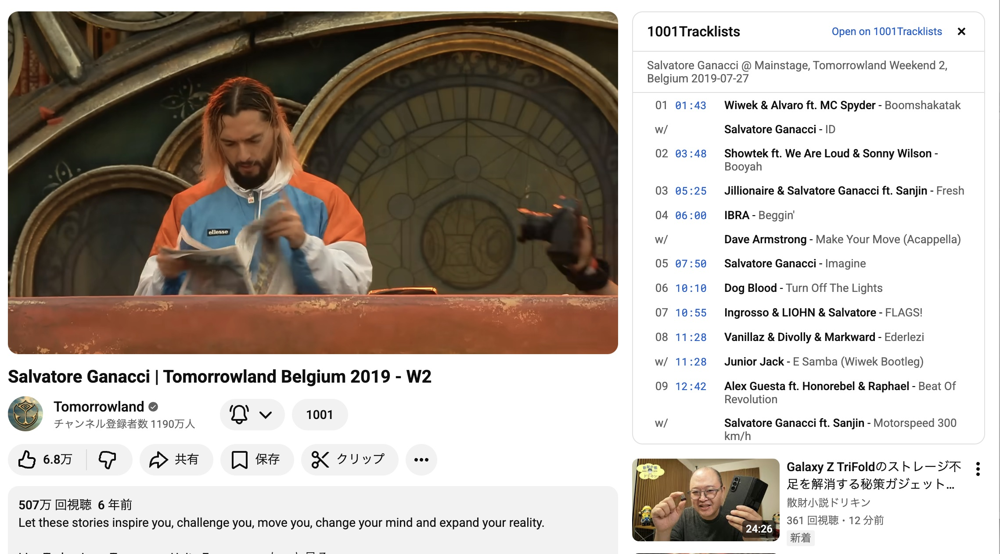

# YouTube Tracklists

YouTubeのDJセット動画に [1001Tracklists](https://www.1001tracklists.com/) のトラックリストを表示するChrome拡張。

## 機能

- 動画ページに「1001」ボタンを表示
- クリックで概要欄の URL or タイトル検索からトラックリストを取得・表示
- タイムスタンプクリックでその時間にジャンプ

## 開発

```bash
npm install
npm run dev        # dev mode (HMR)
npm run build      # production build
npm run lint       # oxlint
```

Chrome で `chrome://extensions` → デベロッパーモード → `.output/chrome-mv3/` を読み込み。

## 構成

```
src/
├── entrypoints/
│   ├── background.ts          # 検索API・スクレイピング管理
│   ├── scraper.content.ts     # 1001tracklists ページからトラック抽出
│   └── youtube.content/       # YouTube content script
└── utils/
    ├── types.ts               # 型定義
    ├── messages.ts            # メッセージング
    ├── dom.ts                 # DOM ユーティリティ
    ├── html.ts                # HTML テンプレート
    ├── search.ts              # 検索ロジック
    └── panel.ts               # パネル/ボタン UI
```

WXT + TypeScript。

## demo


